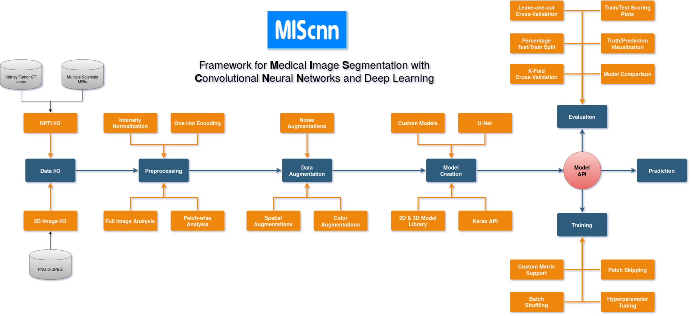
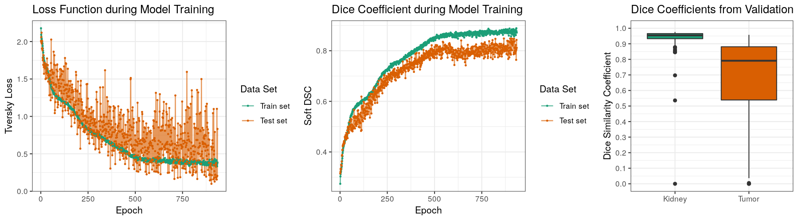

[](https://www.python.org/)
[](https://travis-ci.org/github/frankkramer-lab/MIScnn)
[](https://codecov.io/gh/frankkramer-lab/miscnn)
[](https://pypi.org/project/miscnn/)
[](https://pypistats.org/packages/miscnn)
[](https://www.gnu.org/licenses/gpl-3.0.en.html)


The open-source Python library MIScnn is an intuitive API allowing fast setup of medical image segmentation pipelines with state-of-the-art convolutional neural network and deep learning models in just a few lines of code.

**MIScnn provides several core features:**
- 2D/3D medical image segmentation for binary and multi-class problems
- Data I/O, preprocessing and data augmentation for biomedical images
- Patch-wise and full image analysis
- State-of-the-art deep learning model and metric library
- Intuitive and fast model utilization (training, prediction)
- Multiple automatic evaluation techniques (e.g. cross-validation)
- Custom model, data I/O, pre-/postprocessing and metric support
- Based on Keras with Tensorflow as backend



## Resources

- MIScnn Documentation: [GitHub wiki - Home](https://github.com/frankkramer-lab/MIScnn/wiki)
- MIScnn Tutorials: [Overview of Tutorials](https://github.com/frankkramer-lab/MIScnn/wiki/Tutorials)
- MIScnn Examples: [Overview of Use Cases and Examples](https://github.com/frankkramer-lab/MIScnn/wiki/Examples)
- MIScnn Development Tracker: [GitHub project - MIScnn Development](https://github.com/frankkramer-lab/MIScnn/projects/1)
- MIScnn on GitHub: [GitHub - frankkramer-lab/MIScnn](https://github.com/frankkramer-lab/MIScnn)
- MIScnn on Zenodo: [Zenodo - MIScnn](https://doi.org/10.5281/zenodo.3970863)
- MIScnn on PyPI: [PyPI - miscnn](https://pypi.org/project/miscnn/)

## Getting started: 60 seconds to a MIS pipeline

```python
# Import the MIScnn module
import miscnn

# Create a Data I/O interface for kidney tumor CT scans in NIfTI format
from miscnn.data_loading.interfaces import NIFTI_interface
interface = NIFTI_interface(pattern="case_000[0-9]*", channels=1, classes=3)

# Initialize data path and create the Data I/O instance
data_path = "/home/mudomini/projects/KITS_challenge2019/kits19/data.original/"
data_io = miscnn.Data_IO(interface, data_path)

# Create a Preprocessor instance to configure how to preprocess the data into batches
pp = miscnn.Preprocessor(data_io, batch_size=4, analysis="patchwise-crop",
                         patch_shape=(128,128,128))

# Create a deep learning neural network model with a standard U-Net architecture
from miscnn.neural_network.architecture.unet.standard import Architecture
unet_standard = Architecture()
model = miscnn.Neural_Network(preprocessor=pp, architecture=unet_standard)
```

Congratulations to your ready-to-use Medical Image Segmentation pipeline including data I/O, preprocessing and data augmentation with default setting.

Let's run a model training on our data set. Afterwards, predict the segmentation of a sample using the fitted model.

```python
# Training the model with 80 samples for 500 epochs
sample_list = data_io.get_indiceslist()
model.train(sample_list[0:80], epochs=500)

# Predict the segmentation for 20 samples
pred = model.predict(sample_list[80:100], return_output=True)
```

Now, let's run a 5-fold Cross-Validation with our model, create automatically evaluation figures and save the results into the directory "evaluation_results".

```python
from miscnn.evaluation import cross_validation

cross_validation(sample_list, model, k_fold=5, epochs=100,
                 evaluation_path="evaluation_results", draw_figures=True)
```

More detailed [examples](https://github.com/frankkramer-lab/MIScnn/wiki/Examples) for popular biomedical data sets or diverse [tutorials](https://github.com/frankkramer-lab/MIScnn/wiki/Tutorials) for MIScnn are available as Jupyter Notebooks in this repository.

## Installation

There are two ways to install MIScnn:

- **Install MIScnn from PyPI (recommended):**

Note: These installation steps assume that you are on a Linux or Mac environment. If you are on Windows or in a virtual environment without root, you will need to remove sudo to run the commands below.

```sh
sudo pip install miscnn
```

- **Alternatively: install MIScnn from the GitHub source:**

First, clone MIScnn using git:

```sh
git clone https://github.com/frankkramer-lab/MIScnn
```

Then, cd to the MIScnn folder and run the install command:

```sh
cd MIScnn
sudo python setup.py install
```

## Experiments and Results

The task of the Kidney Tumor Segmentation challenge 2019 (KITS19) was to compute a semantic segmentation of arterial phase abdominal CT scans from 300 kidney cancer patients. Each pixel had to be labeled into one of three classes: Background, kidney or tumor. The original scans have an image resolution of 512x512 and on average 216 slices (highest slice number is 1059).

MIScnn was used on the KITS19 training data set in order to perform a 3-fold cross-validation with a 3D standard U-Net model.




## Author

Dominik Müller\
Email: dominik.mueller@informatik.uni-augsburg.de\
IT-Infrastructure for Translational Medical Research\
University Augsburg\
Bavaria, Germany

## How to cite / More information

Dominik Müller and Frank Kramer. (2019)  
MIScnn: A Framework for Medical Image Segmentation with Convolutional Neural Networks and Deep Learning.  
arXiv e-print: [https://arxiv.org/abs/1910.09308](https://arxiv.org/abs/1910.09308)

```
Article{miscnn,
  title={MIScnn: A Framework for Medical Image Segmentation with Convolutional Neural Networks and Deep Learning},
  author={Dominik Müller and Frank Kramer},
  year={2019},
  eprint={1910.09308},
  archivePrefix={arXiv},
  primaryClass={eess.IV}
}
```

Thank you for citing our work.

## License

This project is licensed under the GNU GENERAL PUBLIC LICENSE Version 3.\
See the LICENSE.md file for license rights and limitations.
