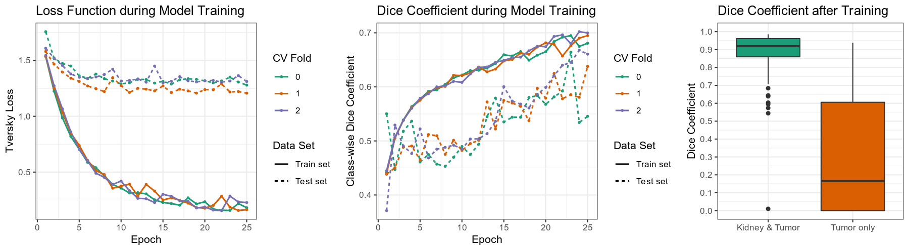

# MIScnn: Medical Image Segmentation with Convolutional Neural Networks

The open-source Python library MIScnn is an intuitive API allowing fast setup of medical image segmentation pipelines with state-of-the-art convolutional neural network and deep learning models in just a few lines of code.

MIScnn provides several core features:
- 2D/3D medical image segmentation for binary and multi-class problems
- Data I/O, preprocessing and data augmentation for biomedical images
- Patch-wise and full image analysis
- State-of-the-art deep learning model and metric library
- Intuitive and fast model utilization (training, prediction)
- Multiple automatic evaluation techniques (e.g. cross-validation)
- Custom model, data I/O, pre-/postprocessing and metric support
- Based on Keras with Tensorflow as backend


## Getting started: 30 seconds to a MIS pipeline

Create a Data I/O instance with an already provided interface for your specific data
format.

```python
from data_loading.data_io import Data_IO
from data_loading.interfaces.nifti_io import NIFTI_interface

# Create an interface for kidney tumor CT scans in NIfTI format
interface = NIFTI_interface(pattern="case_0000[0-2]", channels=1, classes=3)
# Initialize data path and create the Data I/O instance
data_path = "/home/mudomini/projects/KITS_challenge2019/kits19/data.original/"
data_io = Data_IO(interface, data_path)
```

Create a Preprocessor instance to configure how to preprocess the data into batches.

```python
from processing.preprocessor import Preprocessor

pp = Preprocessor(data_io, batch_size=16, analysis="patchwise-crop", patch_shape=(128,128,128))
```

Create a deep learning neural network model with a standard U-Net architecture.

```python
from neural_network.model import Neural_Network
from miscnn.neural_network.architecture.unet.standard import Architecture

unet_standard = Architecture()
model = Neural_Network(preprocessor=pp, architecture=unet_standard)
```
Congratulations to your ready-to-use Medical Image Segmentation pipeline including data I/O, preprocessing and data augmentation with default setting.

Let's run a model training on our data set. Afterwards, predict the segmentation of a sample using the fitted model.

```python
# Training the model with all except one sample for 500 epochs
sample_list = data_io.get_indiceslist()
model.train(sample_list[0:-1], epochs=500)
# Predict the one remaining sample
pred = model.predict([sample_list[-1]], direct_output=True)
```

Now, let's run a 5-fold Cross-Validation with our model, create automatically evaluation figures and save the results into the directory "evaluation_results".

```python
from miscnn.evaluation.cross_validation import cross_validation

cross_validation(sample_list, model, k_fold=5, epochs=100,
                 evaluation_path="evaluation_results", draw_figures=True)
```

## Installation

There are two ways to install MIScnn:

- **Install MIScnn from PyPI (recommended):**

Note: These installation steps assume that you are on a Linux or Mac environment. If you are on Windows or in a virtual environment without root, you will need to remove sudo to run the commands below.

```sh
sudo pip install miscnn
```

- **Alternatively: install MIScnn from the GitHub source:**

First, clone MIScnn using git:

```sh
git clone https://github.com/frankkramer-lab/MIScnn
```

Then, cd to the MIScnn folder and run the install command:

```sh
cd MIScnn
sudo python setup.py install
```

## Experiments and Results

The task of the Kidney Tumor Segmentation challenge 2019 (KITS19) was to compute a semantic segmentation of arterial phase abdominal CT scans from 300 kidney cancer patients. Each pixel had to be labeled into one of three classes: Background, kidney or tumor. The original scans have an image resolution of 512x512 and on average 216 slices (highest slice number is 1059).

MIScnn was used on the KITS19 training data set in order to perform a 3-fold cross-validation with a 3D standard U-Net model.




Additionally, MIScnn was used for participation at the Kidney Tumor Segmentation Challenge 2019. The Git repository for this use case can be found here: https://github.com/muellerdo/kits19.MIScnn

## Coming soon

- Complete documentation/wiki
- Examples (kits19, BraTS, ...)
- Tutorials on Basics, custom Data I/O interfaces, custom models, ...

## Author

Dominik Müller\
Email: dominik.mueller@informatik.uni-augsburg.de\
IT-Infrastructure for Translational Medical Research\
University Augsburg\
Bavaria, Germany

## How to cite / More information

Dominik Müller and Frank Kramer. (2019)\
MIScnn: A Framework for Medical Image Segmentation with Convolutional Neural Networks and Deep Learning.

## License

This project is licensed under the GNU GENERAL PUBLIC LICENSE Version 3.\
See the LICENSE.md file for license rights and limitations.
