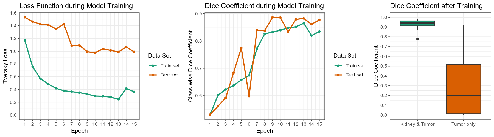

# MIScnn: Medical Image Segmentation with Convolutional Neural Networks

The open-source Python library MIScnn is an intuitive API allowing fast setup of medical image segmentation pipelines with state-of-the-art convolutional neural network and deep learning models in just a few lines of code.

MIScnn provides several core features:
- 2D/3D medical image segmentation for binary and multi-class problems
- Data I/O, preprocessing and data augmentation for biomedical images
- Patch-wise and full image analysis
- State-of-the-art deep learning model and metric library
- Intuitive and fast model utilization (training, prediction)
- Multiple automatic evaluation techniques (e.g. cross-validation)
- Custom model, data I/O and metric support
- Based on Keras with Tensorflow as backend


## Getting started: 30 seconds to a MIS pipeline

Create a configuration object to adjust settings as needed.

```python
from miscnn.configurations import get_options

# Create configuration object with default settings
config = get_options()
# Adjust input parameters
config["data_path"] = "/home/muellerdo/MRIs_KidneyTumor/"
config["data_io"] = "nifti"
# Adjust model parameters
config["classes"] = 3
config["dimension"] = "3D"
config["architecture"] = "unet"
config["model_variant"] = "standard"
# Adjust training parameters
config["epochs"] = 40
# Adjust prediction parameters
config["output_path"] = "predictions/"
```

Create a neural network model with adjusted configurations.

```python
import miscnn.neural_network

model = miscnn.neural_network(config)
```

Run a training pipeline including data I/O, preprocessing and data augmentation with default settings.

```python
training_set = list(range(0, 100))
model.train(training_set)
```

Run a prediction pipeline and save results under "predictions/".

```python
prediction_set = list(range(100, 150))
model.predict(prediction_set)
```

## Experiments and Results

The task of the Kidney Tumor Segmentation challenge 2019 (KITS19) was to compute a semantic segmentation of arterial phase abdominal CT scans from 300 kidney cancer patients. Each pixel had to be labeled into one of three classes: Background, kidney or tumor. The original scans have an image resolution of 512x512 and on average 216 slices (highest slice number is 1059).

MIScnn was used on the KITS19 training data set in order to perform a 3-fold cross-validation with a 3D standard U-Net model.




## Installation

There are two ways to install MIScnn:

- **Install MIScnn from PyPI (recommended):**

Note: These installation steps assume that you are on a Linux or Mac environment. If you are on Windows or in a virtual environment without root, you will need to remove sudo to run the commands below.

```sh
sudo pip install miscnn
```

- **Alternatively: install MIScnn from the GitHub source:**

First, clone MIScnn using git:

```sh
git clone https://github.com/frankkramer-lab/MIScnn
```

Then, cd to the MIScnn folder and run the install command:

```sh
cd MIScnn
sudo python setup.py install
```

## Author

Dominik Müller\
Email: dominik.mueller@informatik.uni-augsburg.de\
IT-Infrastructure for Translational Medical Research\
University Augsburg\
Bavaria, Germany

## How to cite / More information

Dominik Müller and Frank Kramer. (2019)\
MIScnn: A Framework for Medical Image Segmentation with Convolutional Neural Networks and Deep Learning.

## License

This project is licensed under the GNU GENERAL PUBLIC LICENSE Version 3.\
See the LICENSE.md file for license rights and limitations.
